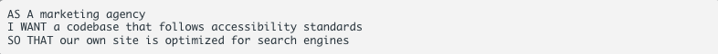
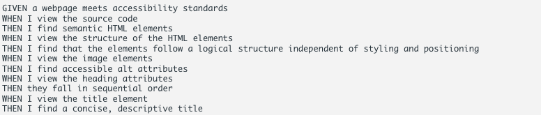

# Horiseon Code Refractor

## Description

For this module challenge we were tasked with going over already created code and refactoring it, so that it is more accessible and follows best practices.

### User Story

### Acceptance Criteria

## Usage

The image below is a screenshot of the deployed application.

## License

Please refer to the LICENSE in the repo.

## Links

Deployed Application: 

Repository: https://github.com/anjaliroland/M1-HTML-CodeRefractor